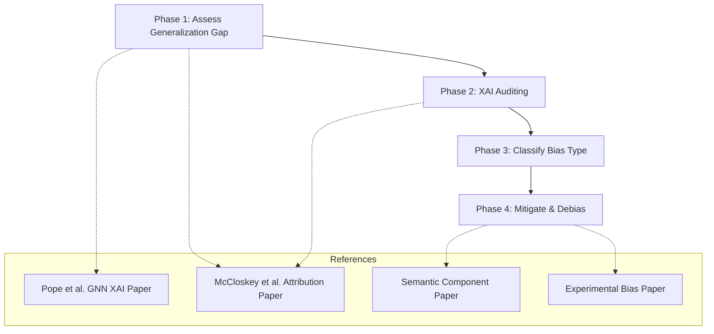

# GNN XAI and Dataset Debiasing Workflow

This document outlines the conceptual workflow for evaluating, explaining (auditing), and debiasing your Graph Neural Network (GNN) model. Each step is mapped to specific literature resources and sections from the research library in your workspace.

---

---

### **Phase 1: Assess the Generalization Gap (Random vs. Scaffold Split)**
Before checking model attributions, determine the baseline vulnerability of the GNN to structural changes.

* **Action:** Compare the model's predictive performance ($R^2$ and RMSE) on a standard **Random Split** versus a **Scaffold Split**.
* **Key Indicators:** A large performance drop on the scaffold split indicates that the GNN is relying on scaffold-specific shortcuts that fail to generalize to out-of-distribution (OOD) chemical spaces.
* **Workspace Resources & Sections:**
  * **Resource:** [Pope_Explainability_Methods_for_Graph_Convolutional_Neural_Networks_CVPR_2019_paper.pdf](file:///C:/Users/yashd/Desktop/from_mobile/NEW/XAI/Pope_Explainability_Methods_for_Graph_Convolutional_Neural_Networks_CVPR_2019_paper.pdf)
    * *Section:* **Section 4.2 (Datasets)**, Page 6.
    * *Context:* Explains that scaffold splitting (from MoleculeNet) partitions molecules according to their structures, grouping similar scaffolds together, which is standard practice to prevent over-optimistic evaluations on graph models.
  * **Resource:** [Using Attribution to Decode Dataset Bias in Neural Network for chemistry.pdf](file:///C:/Users/yashd/Desktop/from_mobile/NEW/XAI/Using%20Attribution%20to%20Decode%20Dataset%20Bias%20in%20Neural%20Network%20for%20chemistry.pdf)
    * *Section:* **Introduction / Page 2**.
    * *Context:* Discusses why standard held-out validation sets fail to catch dataset bias because they share the same experimental selection biases, necessitating more rigorous testing.

---

### **Phase 2: XAI Auditing & Attribution Analysis**
Audit the trained GIN model to identify whether the high performance (even on scaffold splits) is driven by true chemical physics or statistical shortcuts.

* **Action:** Generate node (atom) and edge (bond) attributions (e.g., via Saliency or Integrated Gradients) for correctly predicted and mispredicted test molecules.
* **Key Indicators:** Determine if the GNN highlights atoms corresponding to the active pharmacophore (true mechanism) or if it places high importance on non-causal groups (such as counter-ions, linkers, or highly frequent inert side groups).
* **Workspace Resources & Sections:**
  * **Resource:** [Using Attribution to Decode Dataset Bias in Neural Network for chemistry.pdf](file:///C:/Users/yashd/Desktop/from_mobile/NEW/XAI/Using%20Attribution%20to%20Decode%20Dataset%20Bias%20in%20Neural%20Network%20for%20chemistry.pdf)
    * *Section:* **Discussion / Page 8** & **Section 4 (Zinc+2 Holdout Set) / Page 4**.
    * *Context:* Details how to identify dataset bias by examining model attributions: checking if too much attribution falls on non-causal features or too little falls on causal features, which indicates the model has memorized statistical noise.

---

### **Phase 3: Classifying the Bias Type**
Categorize the diagnosed bias to choose the correct mitigation path:

1. **Feature-Level Shortcut Bias:** The GNN exploits easy-to-learn but non-causal fragments (e.g. molecular size or recurring synthetic remnants) that correlate with the activity labels in the training set.
2. **Sample-Selection Bias:** The dataset itself is biased because of the non-uniform sampling of chemical space (expert chemists' historical preferences of what to study and synthesize).

---

### **Phase 4: Mitigate and Debias (How to Fix It)**
Apply the appropriate algorithmic remedy based on the diagnosed bias:

#### **Method A: Causal Subgraph Disentanglement (For Feature-Level Bias)**
* **Concept:** Separate the molecular representation into a **causal subgraph** (invariant pharmacophore) and a **spurious subgraph** (scaffold noise). Train the model to predict activity using *only* the causal part.
* **Workspace Resources & Sections:**
  * **Resource:** [Identifying Semantic Component for Robust Molecular Property Prediction.pdf](file:///C:/Users/yashd/Desktop/from_mobile/NEW/XAI/Solving/Identifying%20Semantic%20Component%20for%20Robust%20Molecular%20Property%20Prediction.pdf)
    * *Section:* **Section 3 (Methodology)**.
    * *Context:* Details a framework to extract and isolate causally invariant semantic components from the molecule graph while regularizing the model to discard spurious shortcut components.
  * **Resource:** [GNN_Dataset_Bias_Literature.txt](file:///C:/Users/yashd/Desktop/from_mobile/NEW/XAI/Solving/GNN_Dataset_Bias_Literature.txt)
    * *Section:* **Feature-Level / Substructure Shortcut Bias**, Lines 22-54.
    * *Context:* Reviews causal substructure disentanglement approaches specifically for molecular property prediction.

#### **Method B: Inverse Probability Scoring & Counterfactual Regression (For Sample-Selection Bias)**
* **Concept:** Correct for experimental selection biases (historical synthesis and assay conditions) using causal re-weighting.
* **Workspace Resources & Sections:**
  * **Resource:** [Chemical Property Prediction Under Experimental Biases.pdf](file:///C:/Users/yashd/Desktop/from_mobile/NEW/XAI/Solving/Chemical%20Property%20Prediction%20Under%20Experimental%20Biases.pdf)
    * *Section:* **Section 3 (Causal Formulation) & Section 4 (Methodology)**.
    * *Context:* Outlines using Inverse Probability Scoring (IPS) and Counterfactual Regression (CFR) to correct for sampling bias in molecular drug discovery datasets.

#### **Method C: Attribution-Guided Training & Regularization**
* **Concept:** Directly penalize the model when its attributions focus on known non-causal features.
* **Workspace Resources & Sections:**
  * **Resource:** [Using Attribution to Decode Dataset Bias in Neural Network for chemistry.pdf](file:///C:/Users/yashd/Desktop/from_mobile/NEW/XAI/Using%20Attribution%20to%20Decode%20Dataset%20Bias%20in%20Neural%20Network%20for%20chemistry.pdf)
    * *Section:* **Discussion / Page 8-9**.
    * *Context:* Discusses using attribution feedback to guide model simplification, regularization, or targeted dataset augmentation (adding counter-examples) to force the model to correct its internal binding logic.

---

### **Empirical Baseline Analysis (Your Model's Results)**

Here is the side-by-side comparison of your GNN's performance on the two data splits:

| Metric | Random Split Model | Scaffold Split Model | Delta ($\Delta$) / Observations |
| :--- | :--- | :--- | :--- |
| **Train Loss** | 0.4005 | 0.4233 | Train error is highly similar, showing consistent model capacity |
| **Train $R^2$** | 0.7863 | 0.7702 | Model fits training sets similarly across splits |
| **Train RMSE** | 0.6326 | 0.6498 | Similar training error baseline |
| **Test Loss** | 0.8167 | 0.9868 | Test loss increases by **+20.8%** under scaffold shift |
| **Test $R^2$** | **0.5568** | **0.4812** | **Drop of 0.0756 (-13.6%)** in explained variance |
| **Test RMSE** | 0.9005 | 0.9862 | Accuracy deviation increases by **+9.5%** |

#### **Diagnosis from the Results:**
1. **Moderate Scaffold Generalization:**
   Unlike the previous run, the GNN here exhibits much stronger generalization on unseen scaffolds, holding a test $R^2$ of **0.4812** (compared to 0.5568 on random). The drop in performance is only **-13.6%**. This suggests that the combined input representation (GNN + 2048-bit Morgan Fingerprint) helps regularize the model and provides some scaffold-invariant features that generalize across structural boundaries.
2. **Persistent Generalization Gap:**
   The generalization gap ($R^2$ train-test difference) rises from **0.2295** (Random) to **0.2890** (Scaffold). While not catastrophic, this gap indicates that the model still relies on some scaffold-specific feature shortcuts or suffers from sample-selection bias. 

#### **Action Plan for your Notebook:**
1. **Audit (Phase 2):** Run Integrated Gradients to see if the model's predictions on the scaffold test set are heavily driven by the fingerprint inputs (which might capture more global molecular statistics) or the node convolutions (which focus on local graph neighborhoods).
2. **Debias (Phase 4):** Since the performance drop is small, applying mild **Attribution-Guided Regularization** (penalizing non-causal node attributions) or using a **Causal Subgraph Disentanglement** step could bridge the remaining 13.6% gap without sacrificing baseline accuracy.

