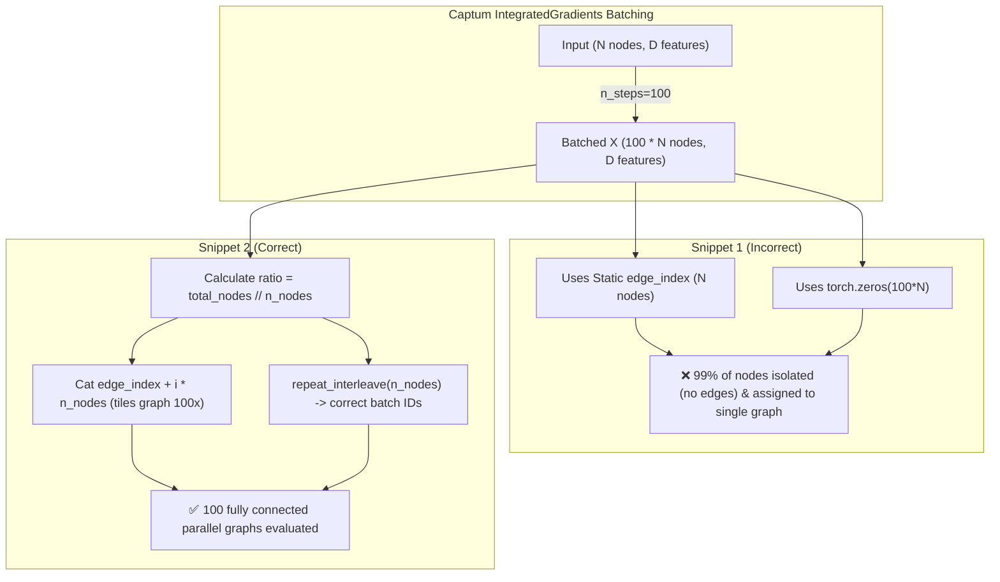

# Integrated Gradients (IG) GNN Attribution: Detailed Wrapper Comparison

This document presents an in-depth technical analysis comparing two PyTorch Geometric (PyG) + Captum `IntegratedGradients` wrapper implementations for Graph Neural Networks (GNNs) with dual inputs (Node Features $x$ and Molecular Fingerprints $fp$).

---

## 1. Overview of the Problem

When applying Captum's `IntegratedGradients` to PyTorch Geometric models, Captum evaluates predictions along $N_{\text{steps}}$ interpolation steps between a baseline and the input. To maximize GPU throughput, Captum **batches all $N_{\text{steps}}$ interpolated graphs together along dimension 0** in a single forward call.

If the custom `torch.nn.Module` wrapper does not account for this batching behavior, the PyG graph structure (specifically `edge_index` and `batch`) breaks, rendering the attributions mathematically invalid or causing runtime dimension mismatches.

---

## 2. Structural & Architectural Comparison



---

## 3. Key Differences Breakdown

### 3.1. Dynamic Batching & Edge Index Offsetting (Critical)

* **Snippet 1 Bug:**
  ```python
  def forward(self, x):
      return self.model(
          atom_num=x,
          edges_index=self.data.edge_index,  # Static! Points only to 0..N-1
          fp=self.data.fps,
          batch=torch.zeros(x.shape[0], dtype=torch.long, device=x.device),  # Everything graph 0
      )
  ```
  * `x.shape[0]` grows to `100 * N_nodes`.
  * `self.data.edge_index` contains indices only up to `N_nodes - 1`.
  * Nodes from `N_nodes` to `100 * N_nodes - 1` have **zero incident edges** and are treated as isolated atoms by PyG message-passing layers.
  * Graph pooling / readout collapses 100 graphs into a single graph with invalid pooled features.

* **Snippet 2 Fix:**
  ```python
  class GraphWrapper(torch.nn.Module):

      def __init__(self, model, edge_index, n_nodes):
          super().__init__()
          self.model = model
          self.edge_index = edge_index
          self.n_nodes = n_nodes

      def forward(self, x, fp):
          total_nodes = x.shape[0]
          ratio = total_nodes // self.n_nodes  # Number of IG interpolation steps stacked

          if ratio == 1:
              edge_index_batched = self.edge_index
              batch_idx = torch.zeros(
                  self.n_nodes, dtype=torch.long, device=x.device
              )
          else:
              edge_index_batched = torch.cat(
                  [self.edge_index + i * self.n_nodes for i in range(ratio)],
                  dim=1,
              )
              batch_idx = torch.arange(
                  ratio, device=x.device
              ).repeat_interleave(self.n_nodes)

          return self.model(
              atom_num=x, edges_index=edge_index_batched, fp=fp, batch=batch_idx
          )
  ```

---

### 3.2. Dual Feature Attribution ($x$ and $fp$)

* **Snippet 1:** Ignores `fp` in attribution (`inputs=x`), holding `fp` static. Gradients with respect to fingerprint bits are omitted, distorting node-level attribution if the model heavily relies on fingerprints.
* **Snippet 2:** Performs joint attribution over both modalities (`inputs=(x, fp)`):
  ```python
  ig = IntegratedGradients(wrapper)
  attr_x, attr_fp = ig.attribute(
      inputs=(x, fp),
      baselines=(torch.zeros_like(x), torch.zeros_like(fp)),
      n_steps=100,
  )
  ```

---

### 3.3. Fingerprint Bit Attribution Visualization

Snippet 2 adds fingerprint feature auditing:
```python
def get_top_fp_bits(attr_fp, fp_vec, top_k=15):
    fp_scores = attr_fp.squeeze().detach().cpu().numpy()
    on_bits = np.nonzero(fp_vec)[0]
    if len(on_bits) == 0:
        return [], []
    on_scores = fp_scores[on_bits]
    order = np.argsort(-np.abs(on_scores))[:top_k]
    top_bits = on_bits[order]
    top_vals = on_scores[order]
    sort_idx = np.argsort(top_vals)
    return top_bits[sort_idx], top_vals[sort_idx]
```

---

## 4. Conclusion

**Snippet 2** is the mathematically sound, bug-free, and complete implementation for PyG + Captum Integrated Gradients on multi-input molecular GNNs.
