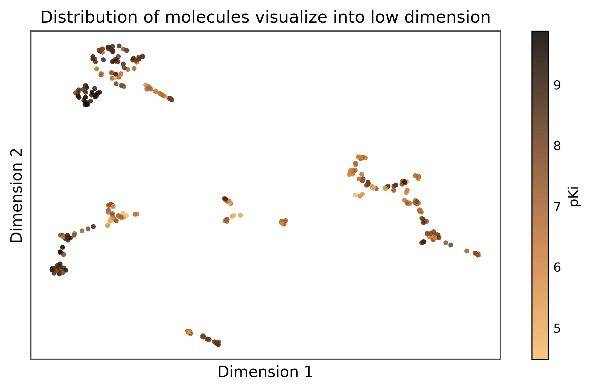
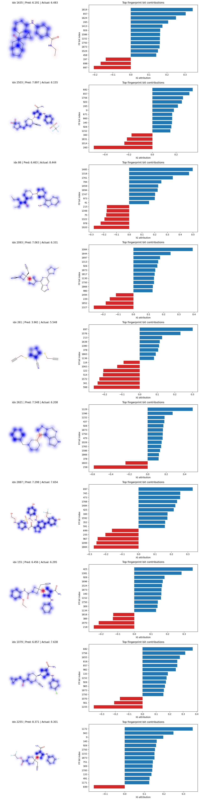

# Janus Kinase 2 (JAK2) Bioactivity Prediction & XAI Pharmacophore Alignment

> ### 🚀 Can we trust Graph Neural Networks for virtual screening?
>
> High predictive performance alone doesn't guarantee that a model has learned the underlying chemistry. In molecular datasets, experimental bias, scaffold bias, and hidden correlations can lead a Graph Neural Network (GNN) to make accurate predictions for the wrong reasons. If that's the case, its performance may not generalize to novel chemical space during virtual screening.
>
> To explore this question, I built an **Explainable AI (XAI) pipeline** for **JAK2 inhibitor activity prediction**, combining **Graph Neural Networks (GNNs)** with **Integrated Gradients** to investigate *why* the model makes its predictions.
>
> Instead of treating the GNN as a black box, I asked:
> 
> **Has the model learned meaningful structure–activity relationships, or is it exploiting spurious correlations present in experimental datasets?**

---

## 📋 Table of Contents
1. [Project Overview & Workflow](#-project-overview--workflow)
2. [Why Explainable AI?](#-why-explainable-ai)
3. [Repository Files & Sitemap](#-repository-files--sitemap)
4. [Dataset & Chemical Space Analysis](#-dataset--chemical-space-analysis)
5. [Literature-Based Consensus JAK2 Pharmacophore](#-literature-based-consensus-jak2-pharmacophore)
6. [Model Architecture](#-model-architecture)
7. [Evaluation Results (Random vs. Scaffold Split)](#-evaluation-results-random-vs-scaffold-split)
8. [XAI Attribution Auditing & Pharmacophore Alignment](#-xai-attribution-auditing--pharmacophore-alignment)
9. [Key Learnings](#-key-learnings)

---

## 🔬 Project Overview & Workflow

* **Curated & Standardized Bioactivity Data**: Processed human JAK2 inhibitor data from **ChEMBL** (CHEMBL1792 target).
* **Graph Molecular Representations**: Converted molecules into 2D graph objects with 6 node features.
* **Hybrid GNN Model**: Trained a 6-layer Graph Isomorphism Network (GIN) combined with 2048-bit ECFP4 Morgan Fingerprints to predict $pIC_{50}$.
* **Integrated Gradients (IG)**: Applied PyTorch Captum to generate joint **atom-level attribution maps** and fingerprint bit rankings.
* **Pharmacophore Auditing**: Validated model attributions against literature-reported consensus **JAK2 pharmacophore features**.

---

## 💡 Why Explainable AI?

Explainable AI provides insight into **which atoms and molecular substructures contribute most to a prediction**. Rather than accepting a prediction at face value, attribution methods help determine whether the model is focusing on **chemically meaningful regions** or relying on dataset-specific shortcuts that may not transfer to new molecules.

---

## 📁 Repository Files & Sitemap

* 📓 **XAI.ipynb**: Primary Jupyter Notebook containing data loading, preprocessing, model training, evaluation, UMAP visualizations, and Integrated Gradients (IG) attributions.
* 📄 **JAK2_Pharmacophore_XAI.md**: Reference guide on the 4-region consensus ATP-competitive JAK2 pharmacophore model and FDA-approved inhibitor structural benchmarks.
* 📄 **GNN_XAI_Debiasing_Workflow.md**: Workflow document detailing GNN XAI debiasing strategies.
* 🐍 **eval_pharmacophore_xai.py**: Python quantitative evaluation pipeline module for computing overlap scores, top-$k$ recall, ROC/PR-AUC, permutation tests, and bootstrap statistics.
* 💾 **gin_scaffold_model.pth**: Pretrained GIN model state checkpoint.
* 📊 **Plots**:
  * **UMAP_Bioactivity_Projection.png**: 2D UMAP projection of chemical space colored by $pIC_{50}$.
  * **random_1.png**: Multi-column attribution grid (GNN atom map, FP structure map, and FP top bit bar chart).
  * **attribution_grid_random.png**: Attribution grid for random test split.
  * **attribution_grid_scaffold.png**: Attribution grid for scaffold test split.

---

## 📊 Dataset & Chemical Space Analysis

Bioactivity data was retrieved from ChEMBL Target ID [CHEMBL1792](https://www.ebi.ac.uk/chembl/target_report_card/CHEMBL1792/) (Human JAK2 Kinase Domain).

### Preprocessing Protocol
1. **Filtering**: Retained exact relations (`=`) with $IC_{50}$ in `nM`.
2. **Standardization**: Applied molecular standardization to SMILES, removed duplicate InChI keys, and calculated log bioactivity:
   $$pIC_{50} = 9 - \log_{10}(IC_{50})$$
3. **Cohort Size**: ~10,310 unique compounds spanning a broad bioactivity range ($3.0 \le pIC_{50} \le 11.5$).

### Chemical Space Projection (UMAP)
We projected 2048-bit Morgan Fingerprints into a 2D manifold using UMAP:



> [!NOTE]
> Active compounds ($pIC_{50} \ge 7.0$) cluster in specific regions of chemical space, demonstrating localized Structure-Activity Relationships (SAR).

---

## 🧬 Literature-Based Consensus JAK2 Pharmacophore

Structural biology and medicinal chemistry establish a **4-Region ATP-Competitive Pharmacophore** in the ATP-binding cleft of the JAK2 kinase domain:

```
 [ Zone 4: Solvent-Exposed Tail ] ── Morpholine, Piperazine, Hydroxyethyl, Nitrile
                 │
 [ Zone 3: Deep ATP Back Pocket ] ── Selectivity Pocket (Gatekeeper Met929)
                 │
 [ Zone 2: Hydrophobic Core ]     ── Lipophilic Pocket (Val863, Ala880, Leu983)
                 │
 [ Zone 1: Hinge Heterocycle ]    ── Pyrrolopyrimidine, Pyrazole, Aminopyrimidine (H-Bonds to Leu932 / Glu930)
```

### Expected vs. Observed Substructure Attributions

| Sub-molecular Region | Literature Pharmacophore Role | Expected XAI Attribution | Observed Model Pattern |
| :--- | :--- | :---: | :---: |
| **Zone 1: Hinge Heterocycle** | Primary H-bond donor/acceptor anchor with Leu932 & Glu930 | **High Positive** | High attribution on central heteroaromatic core |
| **Zone 2: Hydrophobic Core** | Fits lipophilic pocket; van der Waals contacts with Val863 | **High Positive** | High attribution on adjacent linker regions |
| **Zone 3: Deep Back Pocket** | Selectivity region near gatekeeper residue Met929 | **Moderate-High** | Captured via GNN & FP maps |
| **Zone 4: Solvent Tail** | Extends into solvent to optimize solubility & PK properties | **Low / Neutral** | Lower attributions on peripheral substituents |

---

## 🏗️ Model Architecture

```
                       [ 2D Molecular Graph ]
                                 │
                       Node Features (6 dims)
                                 │
                      ┌──────────┴──────────┐
                      │  6x GINConv Layers  │
                      │  (64 -> 128 -> 256) │
                      └──────────┬──────────┘
                                 │
                          Global Mean Pool
                                 │
                      Graph Embedding (256 dims)
                                 │
    [ Morgan Fingerprint ] ──────┼────── (Concatenation)
     (2048-bit ECFP4)            ▼
                          Combined Vector (2176 dims)
                                 │
                      ┌──────────┴──────────┐
                      │   4-Layer MLP       │
                      │   Regressor         │
                      └──────────┬──────────┘
                                 ▼
                          Predicted pIC50
```

* **Node Features (6 dimensions)**: Atomic Number ($\times 0.01$), Atomic Mass ($\times 0.01$), Atom Degree ($\times 0.01$), Formal Charge, Is Aromatic (binary), Radical Electrons.
* **GNN Layers**: 6 `GINConv` layers (`64 -> 64 -> 128 -> 256 -> 256 -> 256`), pooled via `global_mean_pool` into a **256-dim** molecular graph vector.
* **Fingerprint Feature**: 2048-bit ECFP4 fingerprint concatenated to GNN output ($\rightarrow$ **2176-dim** vector).
* **MLP Regressor**: `Linear(2176 -> 512) -> ReLU -> Linear(512 -> 512) -> ReLU -> Linear(512 -> 256) -> ReLU -> Linear(256 -> 128) -> ReLU -> Linear(128 -> 1)`.

---

## 📈 Evaluation Results (Random vs. Scaffold Split)

| Split Strategy | Train Loss (MSE) | Train $R^2$ | Train RMSE | Test Loss (MSE) | Test $R^2$ | Test RMSE |
| :--- | :---: | :---: | :---: | :---: | :---: | :---: |
| **Random Split** (70/30) | 0.2088 | 0.8878 | 0.4583 | 0.7786 | **0.5755** | 0.8813 |
| **Bemis-Murcko Scaffold Split** | 0.3040 | 0.8343 | 0.5516 | 1.0149 | **0.4651** | 1.0014 |

> [!NOTE]
> The model achieves $R^2 = 0.5755$ under random train/test split. Evaluating on out-of-distribution Bemis-Murcko scaffolds yields $R^2 = 0.4651$, testing the model's capacity to generalize across novel chemical families.

---

## 🔍 XAI Attribution Auditing & Pharmacophore Alignment

Attributions were extracted using Integrated Gradients via PyTorch Captum (`IntegratedGradients(wrapper)`):



### Multi-Column XAI Visualization Subplots (`random_1.png`)
* **Left Subplot (GNN Atom Map)**: Atom-level Integrated Gradients attributions ($\text{attr}_x$) projected onto 2D molecular structures (Blue = Positive attribution, Red = Negative attribution).
* **Middle Subplot (FP Structure Map)**: Morgan Fingerprint attributions ($\text{attr}_{\text{fp}}$) mapped back onto 2D atomic coordinates via bit environment matching (`bitInfo`), with **net negative FP attributions highlighted in Red**.
* **Right Subplot (FP Bar Chart)**: Ranks top 15 fingerprint bits by attribution magnitude (Blue = Positive attribution, Red = Negative attribution).

---

## 📚 Key Learnings

This project reinforced that building an accurate model is only part of the challenge. Understanding **why** the model predicts a molecule to be active—and validating those explanations against established medicinal chemistry knowledge—is equally important for developing trustworthy AI models for drug discovery.

Key hands-on skills demonstrated:
- 🧠 **Graph Neural Networks** (PyTorch Geometric, GINConv, Global Readouts)
- 🔍 **Explainable AI** (Integrated Gradients, Captum, Substructure Attribution Mapping)
- 🧪 **Cheminformatics & RDKit** (Standardization, ECFP4 Fingerprints, Substructure Searching)
- 💊 **QSAR & Bioactivity Modeling** ($pIC_{50}$ Regression, Scaffold Generalization)
- 📖 **Pharmacophore Interpretation** (Aligning GNN node attributions with literature ATP-binding clefts)

---
